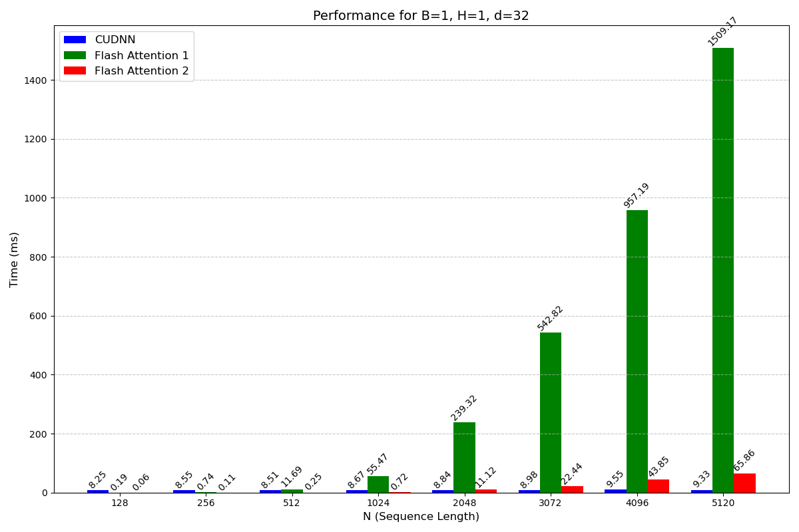

# MyFlashAttention
implement flash attention 1 and 2, and compare them with function scaled_dot_product_attention

# 运行环境
1.如果报错matplotlib缺少libstdc++29的库, 安装后需要export LD_LIBRARY_PATH, 例如/root/miniforge3/lib

# 如何使用
运行test_and_draw.py会在当前目录下生成文件夹, 并写入三种算法的运行时间对比图

例子:

# 实验报告
## 1. Introduction
Tri Dao等人提出了flash attention-1和flash attention-2, 本实验首先使用cuda初步复现了这两个算法, 验证了结果的正确性后尝试在初步复现的基础上进一步优化, 并和pytorch的标准attention计算过程比较运行时间. 本报告章节划分如下: 第二章, 介绍flash attention-1和flash attention-2的复现过程; 第三章, 对比自身实现中优化前后的运行时间; 第四章, 与pytorch的标准attention比较运行时间; 第五章, 实验结果总结.

## 2. Implement
### 2.1 flash attention-1
#### 2.1.1 Preliminary Implementation
实现代码在flash_attention.cu中.

flash attention-1的算法如下:

对于规模为B\*H\*N\*d的输入, 本实验采用的实现方式是, 将线程网格大小设置为B\*H\*1, 因此每个线程块处理一个N\*d矩阵; 将线程块大小设置为Bc\*Br\*1, 并在启动核函数之前采用动态分配的方式提前分配足够的共享内存. 由于线程块三个维度的乘积不能超过1024, 因此Bc\*Br不能超过1024.

在核函数内部, 首先获取Qi, Ki, Vi等变量的首地址, 注意按32字节对齐. 然后开启两层循环: 外层循环用j遍历Tc, 对于每个j, 将对应分块的K和V从全局内存读取到线程块共享内存上; 内层循环用i遍历Tr, 对于每个i, 将对应分块的Q和O从全局内存读取到线程块共享内存上, 并按照上图进行运算. 对于每一个i, 运算完毕后都要将对应分块的O写回全局内存.

#### 2.1.2 Optimize
对于flash attention-1的初步实现, 本实验主要采取以下优化方式:
1. 块内共享内存首地址按16字节对齐, 方便通过float4读取.
2. 加载QKVO到共享内存的时候, 使用float4结构读取, 这样一次可以将4个float读取到寄存器, 减少全局内存IO次数. 将分块的O写回全局内存的时候同理.
3. 计算Q matmul K的时候, 也是用float4从共享内存读取和计算.
4. 计算行和与行最大值的时候使用warp归约运算. 注意这要求Bc不超过32.

### 2.2 flash attention-2
flash attention-2的算法如下

对于规模为B\*H\*N\*d的输入, 将线程网格大小设置为B\*H\*Tr, 线程块大小同上, 采用的优化方法也相同, 区别在于flash attention-2的核函数内部只有一层循环, 即使用j遍历Tc. 而对Tr的遍历分配到了不同的线程块, 每个线程块只处理一个i(0 <= i < Tr).

## 3. Self Compare
本章

1. 三种方法的运行时间都随数据规模的增大而增加. 其中flash attn1的运行时间增加得最多, scaled_dot_product_attention的运行时间增加得最少
2. 在大多数BHd的取值中, 当N<=1024时, flash attn2的运行时间可以低于scaled_dot_product_attention. 随着N的增大, flash attn2的运行时间会逐渐超过scaled_dot_product_attention, 且差距逐渐增大
4. 除了N以外, d的取值对flash attn的运行时间影响也很大, 当d较小(如等于4时), 即使N=5k, scaled_dot_product_attention的运行时间也能达到flash attn2的60%; 但当d较大(如等于32)时, scaled_dot_product_attention在N=5k时的运行时间只有flash attn2的10%
5. scaled_dot_product_attention的运行时间对N和d的变化相对不敏感
6. B和H对三种方法的影响都较大. 对于scaled_dot_product_attention而言, 当N越大时, B和H对其的影响也会增大. 例如当N=5k, 且B或H翻倍时, scaled_dot_product_attention的运行时间也接近翻倍

# 我在实现中采用了哪些方法提升性能
1. 将数据分块从全局内存加载到共享内存, 减少访存开销
2. 使用warp归约求和以及最大值, 减少线程间同步开销
3. 在cuda编译指令中限制线程寄存器数量, 提升SM的并发度
4. 指令向量化, 使用float4实现连续访存, IO次数减少75%, 且更好地利用了内存带宽

# 如何进一步提升性能
1. 扩大共享内存, 减少矩阵的分块数量, 从而减少核函数内的循环次数
2. 将B和H分割, 放入不同的流中并行, 进一步提升并发度
